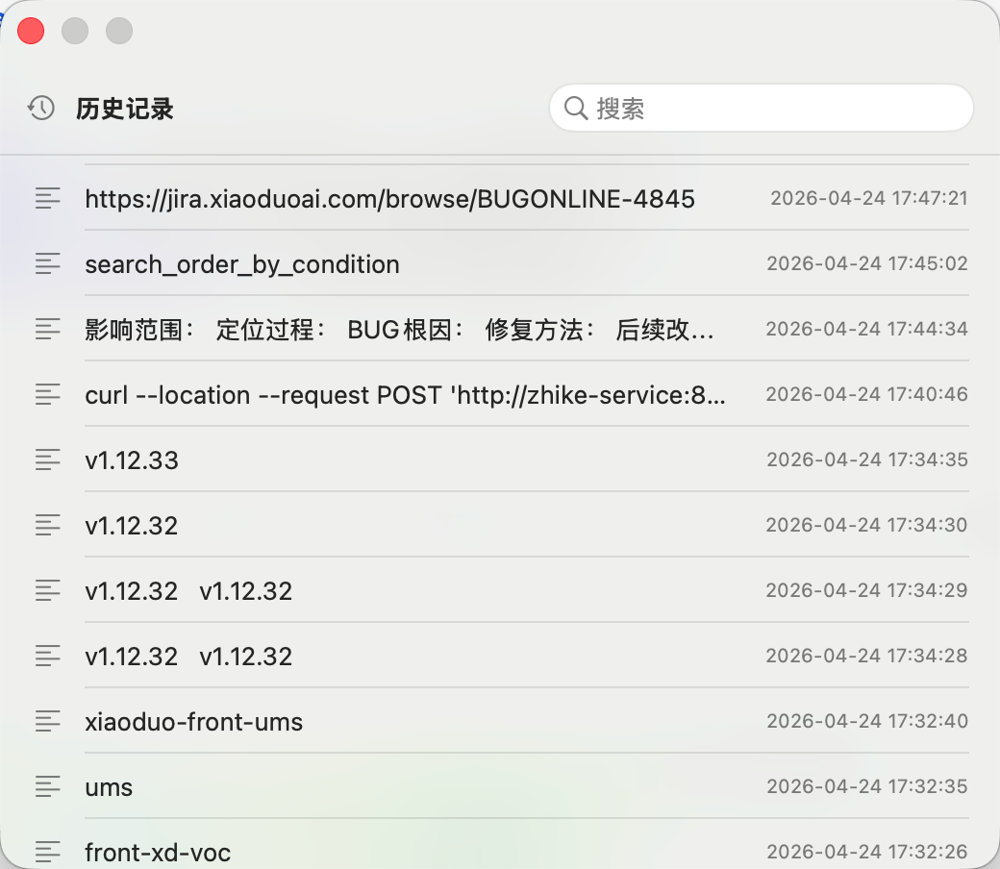
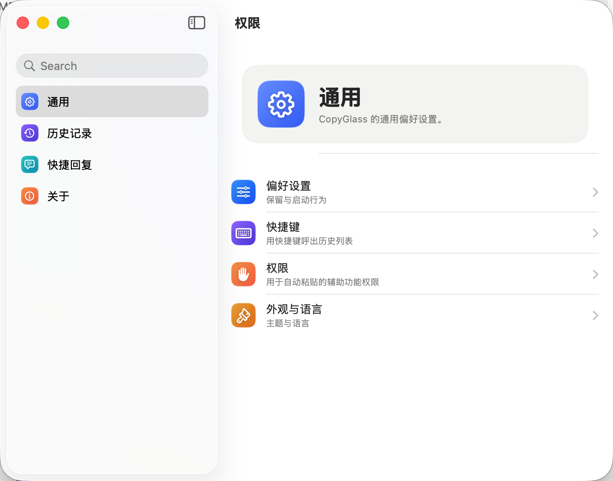

# CopyGlass

CopyGlass 是一款面向 macOS 的剪切板管理工具，采用 Swift、SwiftUI 和 AppKit 构建。它常驻菜单栏，提供剪切板历史、快捷回复、全局快捷键和快速搜索能力，让高频复制、查找和粘贴流程更轻。

[](https://github.com/go-kenka/CopyGlass/actions/workflows/build.yml)

## 特性

- **菜单栏常驻**：应用以 `LSUIElement` 模式运行，不占用 Dock。
- **剪切板历史**：自动记录文本、富文本和图片剪切板内容。
- **快捷回复**：保存常用回复、代码片段、模板文本，并快速复制粘贴。
- **全局快捷键**：无需切换应用，即可呼出主窗口、历史面板和快捷回复面板。
- **快速面板**：使用浮动 `NSPanel` 呈现历史和快捷回复，支持键盘上下选择、回车粘贴、`Cmd+F` 聚焦搜索框。
- **全文搜索**：历史记录使用 SQLite FTS5 建立全文索引，支持更快的内容检索。
- **拼音检索**：中文内容会生成拼音索引，便于使用拼音关键词搜索。
- **保留策略**：支持按 7 天、30 天或永久保留历史记录。
- **Liquid Glass 风格**：窗口采用半透明、毛玻璃视觉，贴近 macOS 原生体验。

## 预览

```markdown


```

## 系统要求

- macOS 14 Sonoma 或更高版本
- Xcode Command Line Tools
- Swift 5.9 或更高版本

## 安装

前往 [Releases](https://github.com/go-kenka/CopyGlass/releases) 下载最新的 `CopyGlass.zip`，解压后将 `CopyGlass.app` 拖入 `Applications` 目录。

> 当前自动构建产物未做代码签名和 notarization。首次运行时，macOS 可能会显示安全提示，需要在「系统设置」中允许打开。

## 权限

CopyGlass 需要辅助功能权限来完成自动粘贴：

1. 打开「系统设置」。
2. 进入「隐私与安全性」。
3. 进入「辅助功能」。
4. 添加并启用 `CopyGlass.app`。
5. 重启 CopyGlass。

如果你重新打包或更换了 Bundle ID，macOS 可能会把它视为新的应用，需要重新授权。

## 默认快捷键

| 功能 | 默认快捷键 |
| --- | --- |
| 打开主窗口 | `Cmd+Shift+V` |
| 打开历史面板 | `Cmd+O` |
| 打开快捷回复面板 | `Cmd+P` |
| 搜索当前面板 | `Cmd+F` |
| 面板内选择上一项 / 下一项 | `↑` / `↓` |
| 复制并粘贴选中项 | `Enter` |
| 关闭面板 | `Esc` |

快捷键可以在应用设置中修改。

## 从源码构建

克隆仓库：

```bash
git clone https://github.com/go-kenka/CopyGlass.git
cd CopyGlass
```

运行测试：

```bash
swift test --disable-sandbox
```

构建可执行文件：

```bash
swift build --disable-sandbox
```

打包为 `.app`：

```bash
./bundle_app.sh
```

构建 release 版本：

```bash
CONFIGURATION=release ./bundle_app.sh
```

打包完成后会在项目根目录生成 `CopyGlass.app`。

## 自动发布

仓库包含 GitHub Actions 工作流：[`.github/workflows/build.yml`](.github/workflows/build.yml)。

工作流只在推送 `v*` tag 时自动触发，也可以在 GitHub Actions 页面手动触发：

```bash
git tag v1.0.0
git push origin v1.0.0
```

触发后会执行：

1. 运行测试。
2. 使用 release 配置构建 `CopyGlass.app`。
3. 压缩为 `CopyGlass.zip`。
4. 上传 GitHub Actions artifact。
5. 对 `v*` tag 创建 GitHub Release，并上传 `CopyGlass.zip`。

## 数据存储

CopyGlass 使用 SQLite 保存本地数据，默认目录为：

```text
~/Library/Application Support/CopyGlass
```

历史记录使用 SQLite FTS5 建立全文索引。数据只存储在本机，项目当前没有远程同步逻辑。

## 技术栈

- Swift 5.9
- SwiftUI
- AppKit
- Carbon HotKey API
- SQLite / FTS5
- GitHub Actions

## 项目结构

```text
Sources/
  App/              App 入口、状态栏控制、浮动面板控制
  Models/           剪切板和快捷回复数据模型
  Storage/          SQLite 存储、FTS5 查询、数据表初始化
  Utils/            快捷键、路径、粘贴板、格式化等工具
  ViewModels/       剪切板监听、快捷回复和面板状态
  Views/            设置页、历史列表、快捷回复和通用组件
Tests/              单元测试
Tools/              图标生成工具
```

## 开发提示

- 应用通过 `NSPasteboard.changeCount` 轮询剪切板变化。
- 快捷键使用 Carbon 框架注册全局热键。
- 打包脚本会复制 `Info.plist`、图标和 SwiftPM 资源 bundle。
- Bundle ID 当前为 `com.github.go-kenka.CopyGlass`。

## 许可证

当前仓库尚未包含 LICENSE 文件。发布开源版本前，建议补充明确的开源许可证，例如 MIT、Apache-2.0 或 GPL。
